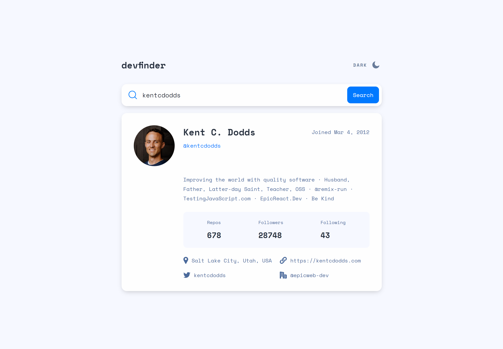
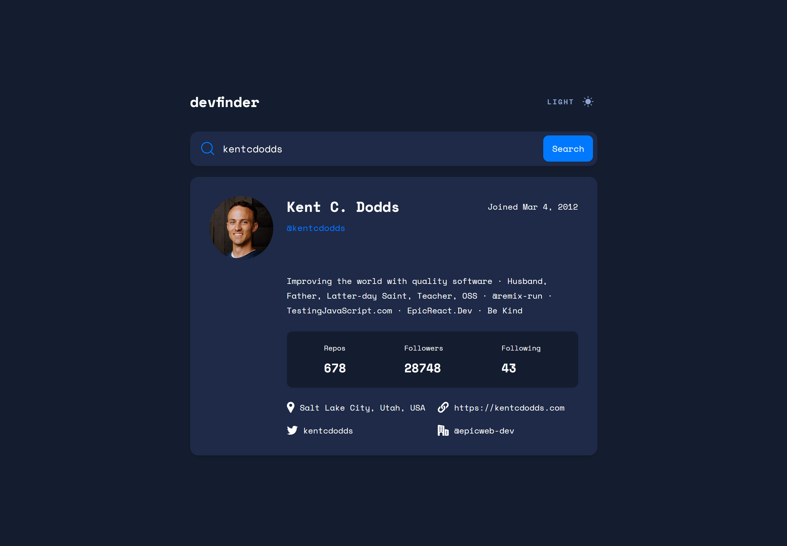

<h2 align="left">GitHub user search - app for searching information about developers account on github</h4>
<h3 align='left'>About project 🔍</h3> 

Solution of frontend mentor challenge. The application generates information taken from the github API about the user's account, such as login, name, number of followers, repositories, etc.

💻 Link to the challenge (You have to have premium account): https://www.frontendmentor.io/challenges/github-user-search-app-Q09YOgaH6/hub

<h2 align='left'>Technologies used 💎</h2> 

React 🔹 Typescript 🔹 Styled components 🔹 API

 
